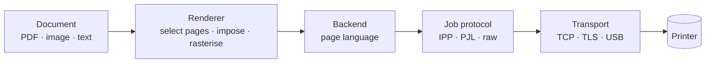

<div align="center">

# Platen

**Print from Android the way you print from a PC.**<br>
Open source · No ads · No account · No telemetry

[](https://github.com/zsozso01/platen/actions/workflows/ci.yml)
[](LICENSE)


</div>

> **Pre-alpha, built in public.** The protocol foundations are written and tested; the app is not yet
> usable for printing. Follow along in the [roadmap](docs/ROADMAP.md), and see
> [what works today](#what-works-today).

Android's built-in print dialog gives you a handful of options, and manufacturer apps want accounts,
show ads and only support their own printers. Platen is a different take: a printing app that talks
**directly to your printer using open standards**, and exposes the controls you would expect on a computer.

## The idea

* **Direct, standards-based printing.** IPP/IPPS, USB, raw JetDirect, PDF, PostScript, PCL, PJL. No vendor app, no cloud.
* **PC-class settings.** Page ranges, copies and collation, paper size and tray, duplex and binding, colour, quality and resolution, scaling (actual size, fit, fill, custom), margins, pages per sheet, booklets, reverse order, odd/even, saved presets, print preview.
* **Detects what your printer can do, instead of guessing.** Platen asks the printer for its capabilities and
  adapts the settings screen. There is no giant printer database to maintain. Whatever the printer cannot
  do in hardware (for example duplex on a simplex inkjet), Platen does itself and tells you.
* **Works with a USB cable.** Plug a printer into your phone with an OTG adapter.
* **Respects you.** No ads, no account, no telemetry, no off-device traffic except to your printer. See [PRIVACY](docs/PRIVACY.md).

## How it works



Each stage is a plug-in point, so supporting a new printer language or connection means writing one
module, not touching the rest. Details in [docs/ARCHITECTURE.md](docs/ARCHITECTURE.md).

## What works today

| | |
|---|---|
| ✅ IPP: binary codec, HTTP framing, client (`Get-Printer-Attributes`, `Print-Job`, `Validate-Job`, job status, cancel), typed capability view | tested, fuzzed |
| ✅ PJL: job headers, queries, status and `INFO VARIABLES` parsing | tested |
| ✅ IEEE 1284 Device ID parsing (USB printers) | tested |
| ✅ PWG Raster writer and reader (the format driverless inkjets accept) | matches the spec's own samples byte for byte |
| ✅ Layout planner: page ranges, reverse, odd/even, scaling, margins, orientation, pages per sheet, booklet | tested |
| ✅ Print planner: from what a printer reports, decides per setting whether the printer or Platen does it (PDF pass-through vs raster, duplex, collation, ...) | tested |
| ✅ Print engine and IPP route: plan, render, send, follow, cancel, report paper-out, manual duplex | tested end to end against a fake printer on a real socket |
| ✅ Fake IPP printer for development without hardware | tested |
| 🚧 The Android side of Wi-Fi printing: PDF rendering with `PdfRenderer`, mDNS discovery, a screen to pick a document and print | next |
| 📋 USB printing, settings UI, previews, presets, share target, Android print service | see [roadmap](docs/ROADMAP.md) |

## First validation printers

The architecture is not built around any manufacturer. Two printers were chosen because together they
cover most of the design:

* **HP DeskJet 3700 series**, over Wi-Fi: a low-end inkjet that accepts *no PDF* and only driverless
  raster formats. Proves the raster pipeline. [Notes](docs/printers/hp-deskjet-3700.md)
* **HP LaserJet Managed MFP E42540**, over USB: a laser that takes PDF, PostScript and PCL natively.
  Proves the USB path. [Notes](docs/printers/hp-laserjet-managed-mfp-e42540.md)

Nothing has been tested on real hardware yet. Both notes list what is verified, what is inferred and
what is still unknown. **If you have a printer, a [compatibility report](https://github.com/zsozso01/platen/issues/new?template=printer_report.yml)
helps more than anything else.**

## Build it

Requires JDK 21 and the Android SDK (platform 36). Full guide: [docs/DEVELOPMENT.md](docs/DEVELOPMENT.md).

```bash
git clone https://github.com/zsozso01/platen.git
cd platen
echo "sdk.dir=$ANDROID_HOME" > local.properties
./gradlew build
```

Try it without a printer: `./gradlew :testing:fake-printer:run --args="inkjet 6310"`, then add
`ipp://10.0.2.2:6310/ipp/print` from the Android emulator.

## Contributing

Very welcome, especially printer reports and protocol work. Start with [CONTRIBUTING.md](CONTRIBUTING.md).
The `protocol/*` modules are pure Kotlin and the easiest place to begin.

## Documentation

* [Architecture](docs/ARCHITECTURE.md) · [Roadmap](docs/ROADMAP.md) · [Development](docs/DEVELOPMENT.md) · [Android platform notes](docs/PLATFORM-NOTES.md)
* [Printer notes](docs/printers/) · [Decision records](docs/adr/) · [Privacy](docs/PRIVACY.md) · [Security](SECURITY.md)

## License

[Apache License 2.0](LICENSE).

HP, DeskJet, LaserJet and other product names are trademarks of their respective owners. They are used
here only to say which printers were tested. Platen is an independent project and is not affiliated with or
endorsed by any printer manufacturer.
