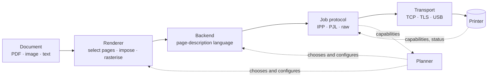

# Architecture

Platen turns "print this document with these settings" into bytes a specific printer understands,
and gets those bytes there. This page explains how the pieces fit, why they are split the way they
are, and where to plug in support for a new printer, language or connection.

> **Status key** used below: ✅ exists in the repo and has tests · 🚧 in progress · 📋 designed, not started.

## The pipeline



The original sketch was `Document → Rendering → Language backend → Transport → Printer`. Research on
the two first-target printers (see [printers/](printers/)) showed that one more layer is needed, so the
last step is split in two:

* **Job protocol**: *how the job and its settings are described to the printer.* IPP carries settings as
  attributes. PJL carries them as `@PJL SET` commands in front of the page data. Plain raw printing
  carries none, so settings must live inside the page language.
* **Transport**: *how bytes physically move.* A TCP socket, a TLS socket, a USB bulk endpoint.

These really are independent. IPP runs over TCP, over TLS, **and over a USB interface** (IPP-over-USB, USB
class 7/1/4). PJL runs over raw TCP port 9100 and over a plain USB printer interface. Treating them as
one layer would mean writing IPP-over-USB as a separate stack.

## Extension points

A contributor adding support for something new implements exactly one of these:

| You want to add | You implement | Examples |
|---|---|---|
| A page language the printer understands | **Backend** | PDF pass-through, PWG Raster, Apple Raster (URF), PostScript, PCL 5, PCL XL |
| A way of describing and controlling a job | **Job protocol** | IPP, PJL over raw, LPD |
| A way of moving bytes | **Transport** | TCP, TLS (with trust-on-first-use), USB bulk, USB IPP interface |
| A way of finding printers | **Discovery** | mDNS/DNS-SD, USB enumeration, manual address, Wi-Fi Direct |

The interfaces for these live in `core:engine` (📋). Everything else is composed from them.

## Capability detection (no printer database)

Platen asks the printer what it can do and believes the answer. Sources, best first:

1. **IPP `Get-Printer-Attributes`** ✅: formats, sides, media, trays, resolutions, colour modes, margins,
   supplies, raster parameters. Works over the network and over USB.
2. **PJL `INFO VARIABLES` / `INFO CONFIG`** ✅ (parser): the legal values of each PJL setting: paper
   sizes, trays, duplex, resolution.
3. **IEEE 1284 Device ID `CMD:` field** ✅ (parser): a list of languages the printer claims. Treated as a
   *hint*, because spellings vary and some printers list formats they only accept over IPP.
4. **A small, data-driven quirks table** 📋: for printers that are known to lie or misbehave (needs a
   longer timeout, rejects a particular attribute). Never used to *add* capabilities, only to work around
   faults. The table is plain data, so contributing an entry does not need code.

Every detected capability remembers where it came from, so the UI can tell "the printer says it can do
duplex" from "we assume it can".

## Where each setting is honoured

A setting can be carried out in three places. The **planner** 📋 decides per setting and shows the user
the result, so nothing is silently dropped.

| Place | Examples | When |
|---|---|---|
| **By the printer**, via the job protocol | copies, sides, media, tray, colour mode, quality, resolution | the printer advertises support |
| **By Platen**, before sending | page ranges, reverse order, odd/even, pages per sheet, booklet, scaling, margins, rotation, **manual duplex** | always possible; required when the printer cannot |
| **Not at all** | borderless on a printer that cannot, a tray that does not exist | shown to the user as a warning before printing |

The first target printers show why this matters. The HP DeskJet 3700 is simplex-only and portrait-only,
so over Wi-Fi Platen must do duplex (odd pages, prompt, even pages) and landscape itself. The HP LaserJet
E42540 can do all of it in hardware, and Platen should use the hardware.

## Module map

```
app/                    Android application: Compose UI, printer store,
                        job manager and foreground service                 ✅
build-logic/            Gradle convention plugins                          ✅

core/
  model/                Domain types: printer, capabilities, settings, job ✅
  layout/               Page selection, scaling, orientation, margins,
                        n-up and booklet imposition as per-side placements ✅
  engine/               Backend / JobProtocol / SideRasterizer interfaces,
                        the printer planner, the job runner                ✅

protocol/               Wire formats. Pure Kotlin, no Android, no core.
  ieee1284/             Device ID parser                                   ✅
  pjl/                  Printer Job Language                               ✅
  ipp/                  IPP codec, HTTP framing, client, typed attributes  ✅
  raster/               PWG Raster writer and reader                       ✅
                        (Apple Raster / URF to follow)                     📋

backend/                Page-language writers (depend on core + protocol)
  raster/               Stream planned faces into the PWG Raster writer    ✅
                        (PDF pass-through needs no writer: the engine
                        copies the original file)

route/                  Job protocols: capability probe + send + follow
  ipp/                  IPP: attribute mapping, job ticket, status         ✅

transport/              Byte pipes
  network/              Plain TCP connector and printer-address parsing    ✅
                        (TLS / ipps with trust-on-first-use                📋)

platform/               Android specifics (Android libraries)
  render/               PdfRenderer and image documents, banded rasteriser,
                        document opener                                    ✅
  usb/                  UsbManager transport and printer-interface probing 📋
  discovery/            mDNS / NSD                                         📋
  printservice/         Android PrintService                               📋

testing/
  fake-printer/         In-process IPP printer; also runnable standalone   ✅
  support/              Synthetic documents, capability fixtures shaped
                        like the two target printers, a block rasteriser   ✅
```

**Dependency rules** (enforced by review, and later by a Gradle check):

* `protocol/*` depend on nothing in this repository and nothing from Android. They could be published as
  standalone libraries, and they are the easiest place to start contributing.
* `core/model` depends on nothing. `core/engine` depends on `core/model`.
* `backend/*` and `transport/*` depend on `core/*` and, where needed, `protocol/*`.
* `platform/*` may use Android APIs and depend on `core/*`, `protocol/*`, `backend/*`, `transport/*`.
* Only `app` depends on everything.

## Concurrency and cancellation

Protocol and transport code is plain blocking Kotlin so it is simple to test and reuse. The engine runs
it on `Dispatchers.IO` and cancels a job by **closing the connection**, which unblocks any pending read or
write. USB transfers get the same treatment (cancel the pending request, then close the interface).

## Robustness principles

* **The peer is untrusted.** A printer, or anything pretending to be one on the LAN, can send garbage.
  Parsers bound every length, depth and count, and fail with a typed error. `IppDecoder` is fuzz-tested
  with tens of thousands of truncated and corrupted messages.
* **"Not reported" is a normal answer.** Typed attribute accessors return empty values, never throw.
* **One request, one connection** for IPP over TCP. No connection pooling means no stale-state bugs.
  IPP over USB is different (the interface *is* the connection) and has its own rules: always read each
  response to its end, never send `Connection: close`. See `IppHttpTransport.sendConnectionClose`.
* **Settings are validated, not trusted.** Values that go into PJL are checked so a hostile file name
  cannot inject printer commands.

## Testing

| Layer | How |
|---|---|
| Parsers and encoders | Unit tests with byte-exact expectations; fuzz-style tests for decoders ✅ |
| Client against a printer | `FakeIppPrinter` speaks real HTTP/IPP over a loopback socket, with fault injection ✅ |
| Whole pipeline | Planner, raster backend, PWG writer, IPP client and job protocol against the fake printer, checking the bytes and attributes it received ✅ |
| Raster output | The PWG Raster writer reproduces the spec's own sample encodings byte for byte ✅; golden-file tests of rendered pages 📋 |
| Layout | Property tests: every placed page stays inside the printable area; booklet order is exact ✅ |
| UI | Compose tests on the emulator, driving the app against `FakeIppPrinter` 📋 |
| Real hardware | A per-printer checklist in [printers/](printers/); results go into the compatibility notes |

`FakeIppPrinter` can run standalone, so the app can be exercised in the emulator without any printer:
see [DEVELOPMENT.md](DEVELOPMENT.md).
